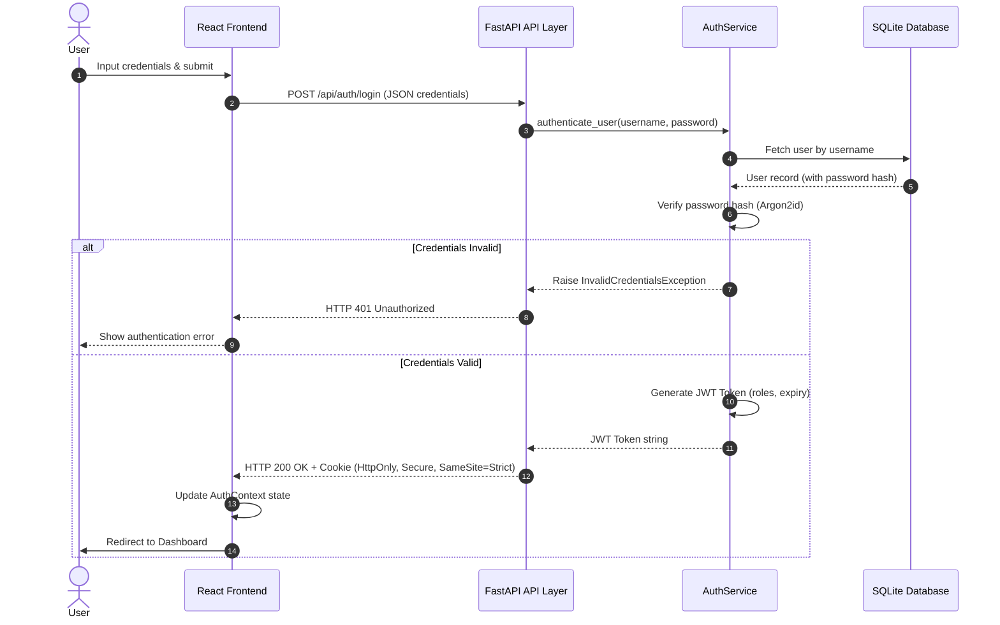
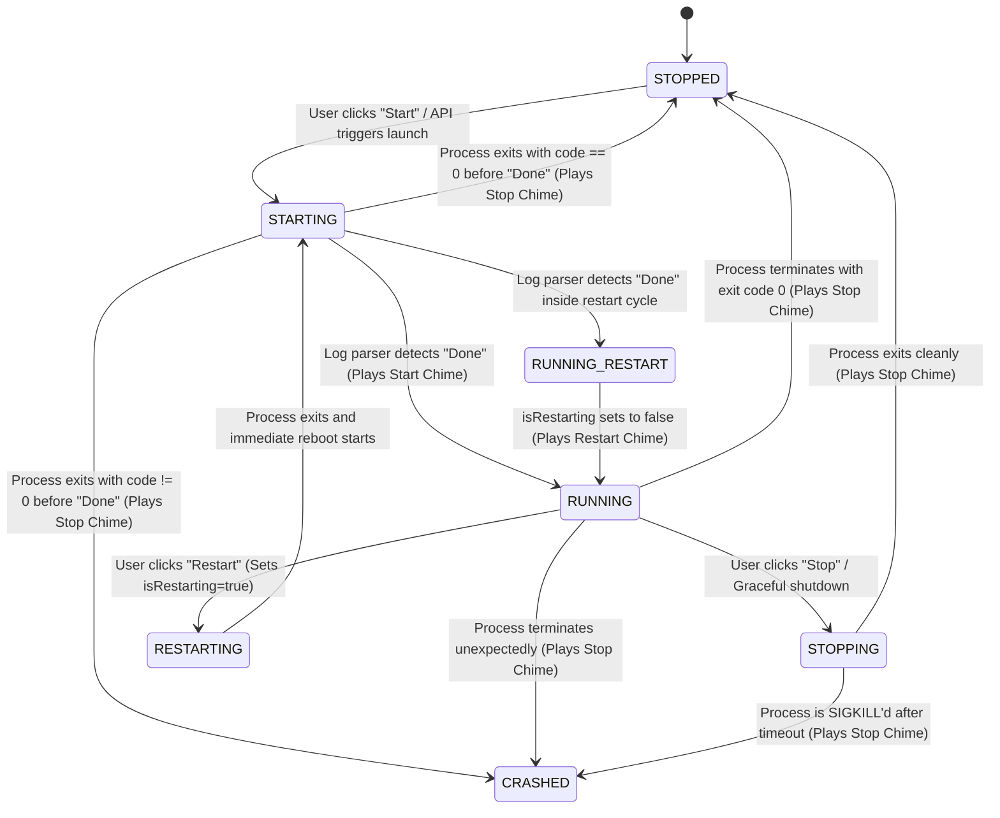
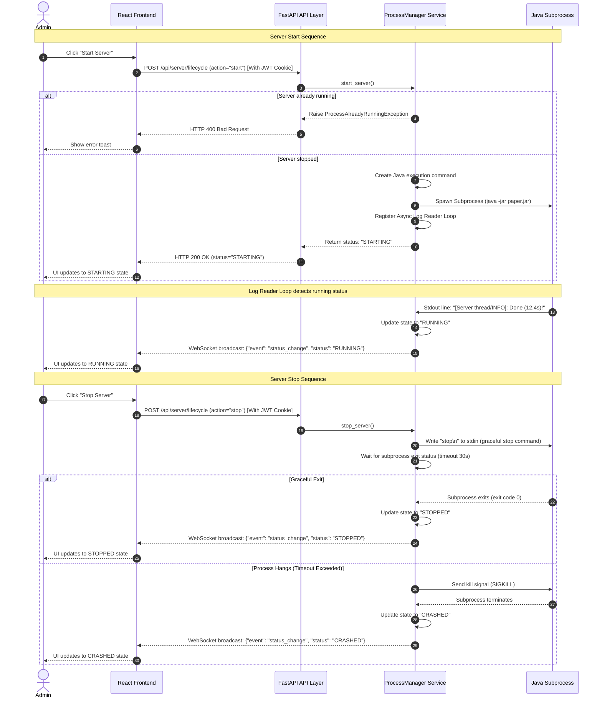
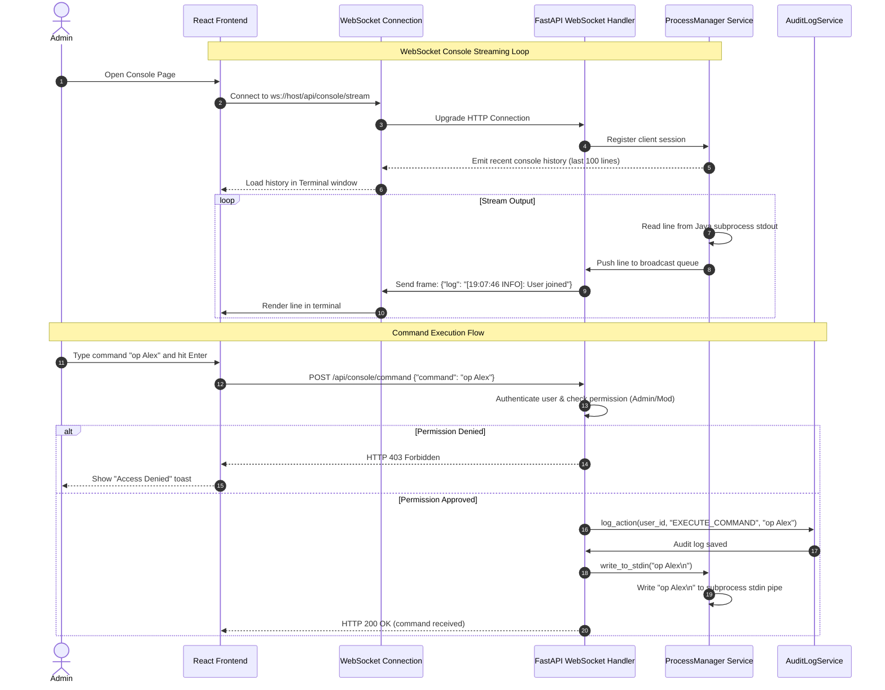
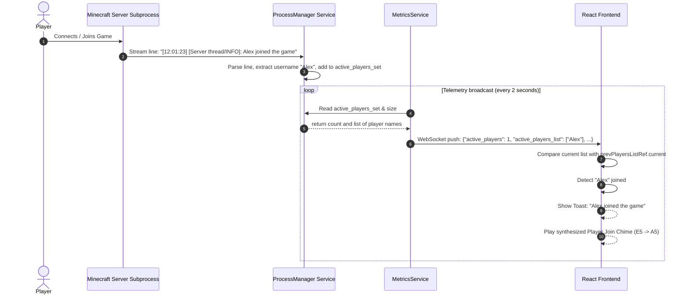
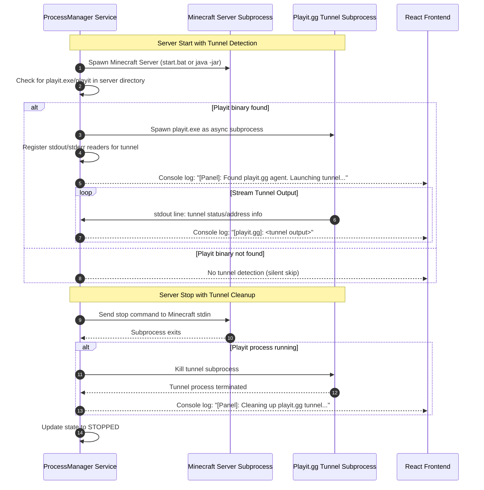
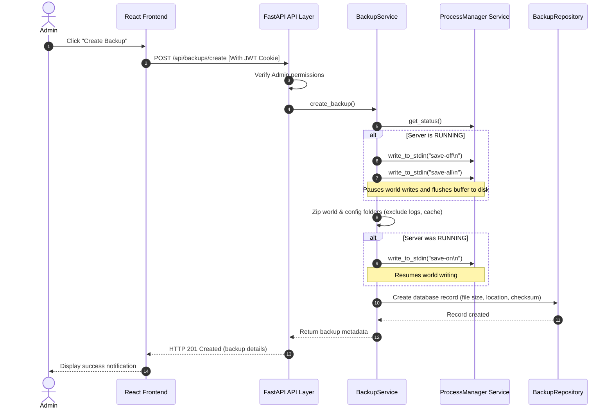
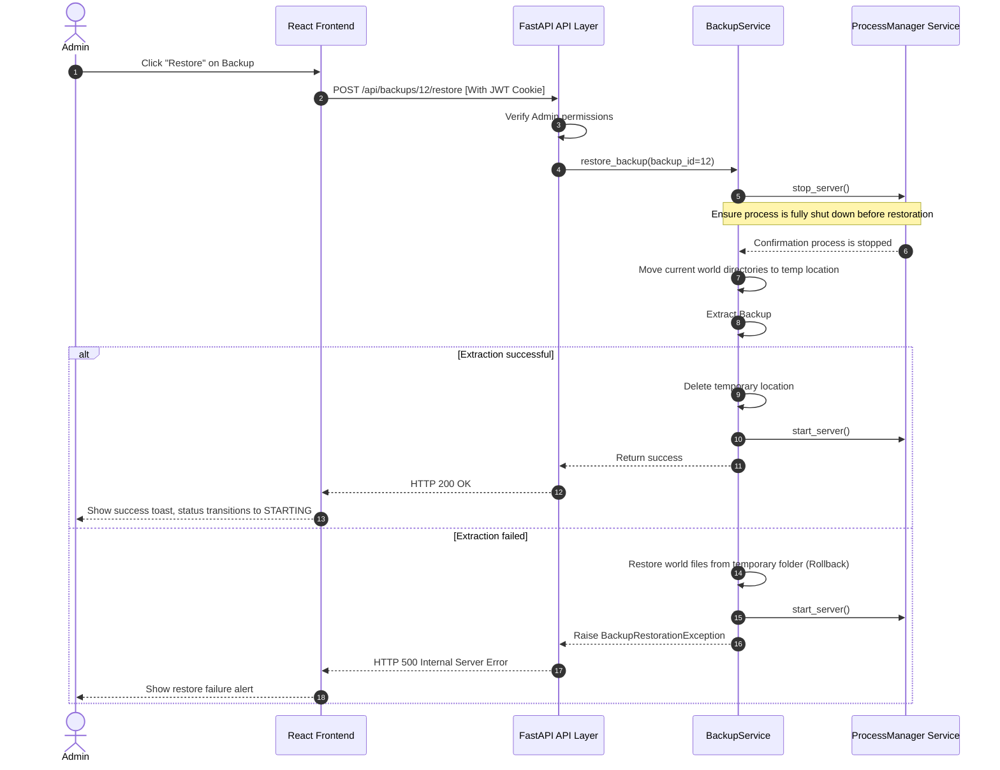
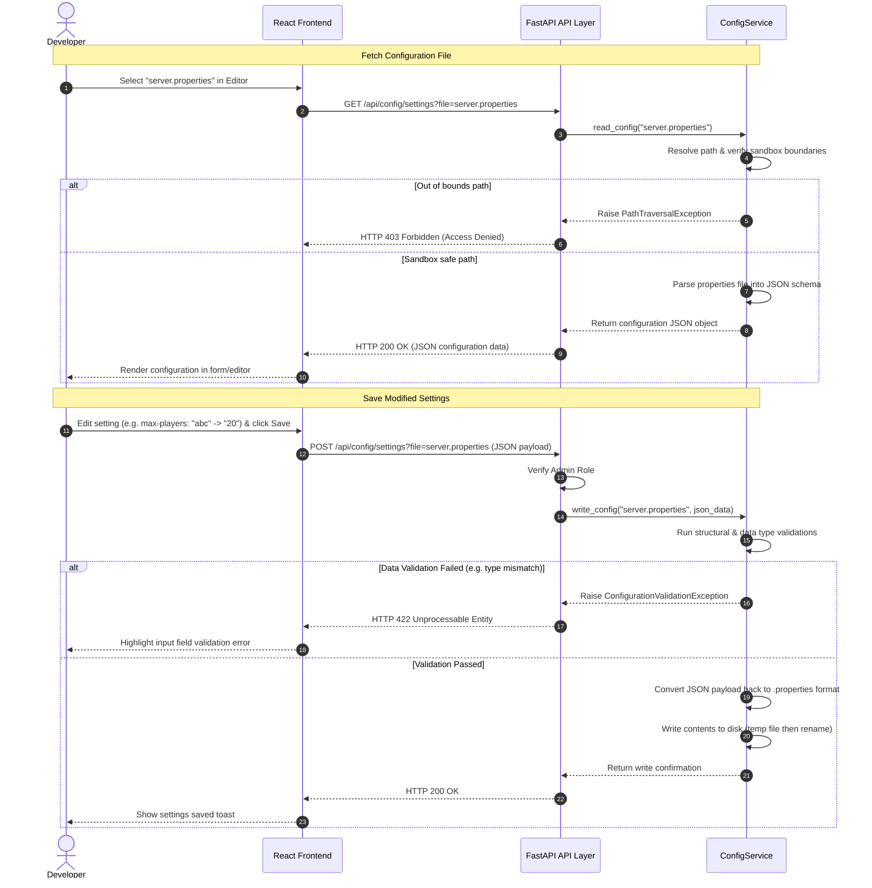
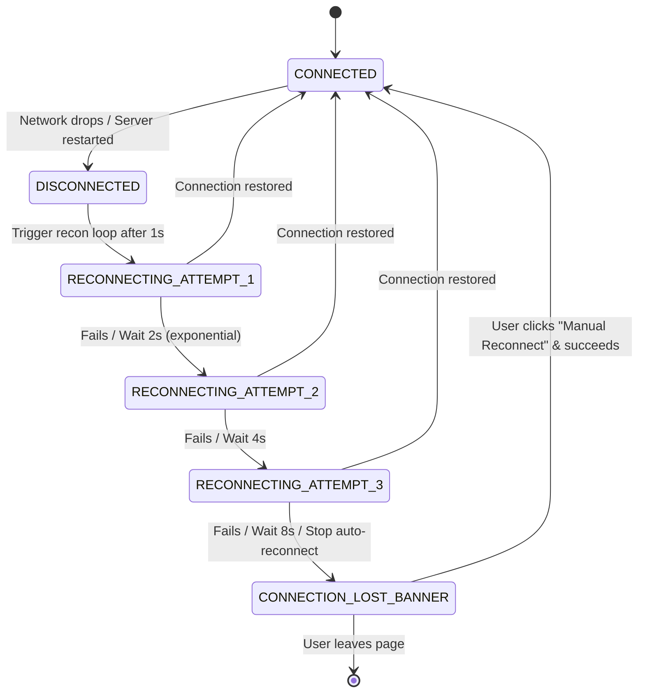

# Application Flow and Diagrams (AppFlow)

## 1. Authentication Flow
The sequence diagram below shows how a user authenticates with the frontend, receives a secure HttpOnly JWT cookie, and accesses protected endpoints.

---

## 2. Server Lifecycle State Machine
The Minecraft server process transitions through specific states based on administrator action or operating system feedback. The panel uses a cascading launch strategy: on Windows, it first attempts `start.bat`, then falls back to direct `java -jar` execution. During transitions, synthesized 8-bit sound chimes are played in the browser.

---

## 3. Server Lifecycle Management Flow
Below is the sequence for starting or gracefully stopping the Minecraft server process.

---

## 4. Console Management & Command Execution Flow
This diagram details how the panel streams log outputs via WebSocket to active clients and handles console input.

---

## 4.5 Player Join/Disconnect Telemetry & Chime Flow
This diagram details how the backend parses player events from the server stream, extends metrics telemetry, and triggers chimes and toast alerts on the React frontend.

---

## 4.6 Playit.gg Tunnel Auto-Detection Flow
This diagram details how the panel detects and manages the playit.gg tunnel agent alongside the Minecraft server process.

---

## 5. Backup Flow
Manual backup generation requires stopping disk activity temporarily to avoid copying corrupted files.

---

## 6. Restore Flow
Restoring a backup completely overwrites active server files and requires a process shutdown.

---

## 7. Configuration Management Flow
This sequence shows the path validation logic enforced when retrieving or modifying settings.

---

## 8. WebSocket Reconnection and Error Flow
Handles recovery from unexpected communication drops.

