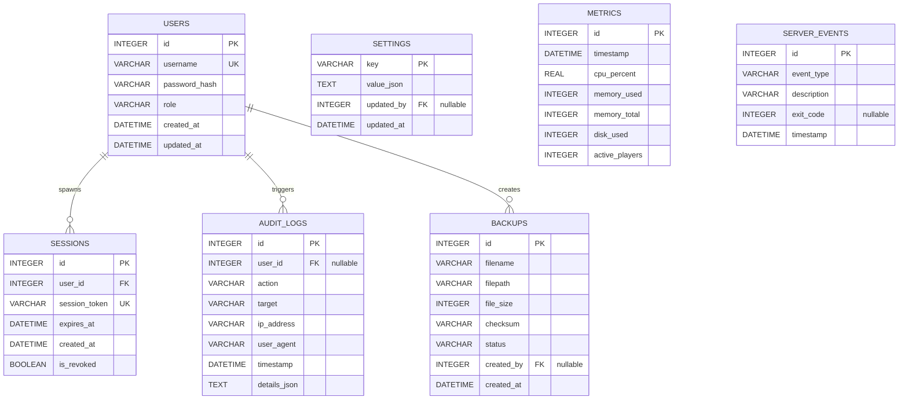

# Database Schema Design (Schema)

## 1. Database Overview
The application database for the initial version is SQLite, configured with Write-Ahead Logging (WAL) and foreign key constraints enabled. The schema is normalized and designed to be compatible with PostgreSQL for seamless future migrations.

### SQLite Pragma Settings (Applied on connection initialization)
```sql
PRAGMA foreign_keys = ON;
PRAGMA journal_mode = WAL;
PRAGMA synchronous = NORMAL;
PRAGMA busy_timeout = 5000;
```

---

## 2. Entity Relationship Diagram (ERD)



---

## 3. Table Definitions & SQL Schema

### 1. `users` Table
Stores authentication data and system access privileges.
```sql
CREATE TABLE users (
    id INTEGER PRIMARY KEY AUTOINCREMENT,
    username VARCHAR(50) NOT NULL UNIQUE,
    password_hash VARCHAR(255) NOT NULL,
    role VARCHAR(20) NOT NULL CHECK (role IN ('ROLE_ADMIN', 'ROLE_MODERATOR')),
    created_at DATETIME NOT NULL DEFAULT CURRENT_TIMESTAMP,
    updated_at DATETIME NOT NULL DEFAULT CURRENT_TIMESTAMP
);

-- Index for searching users
CREATE INDEX idx_users_username ON users(username);
```

---

### 2. `sessions` Table
Maintains user session state for credential revocation.
```sql
CREATE TABLE sessions (
    id INTEGER PRIMARY KEY AUTOINCREMENT,
    user_id INTEGER NOT NULL,
    session_token VARCHAR(255) NOT NULL UNIQUE,
    expires_at DATETIME NOT NULL,
    created_at DATETIME NOT NULL DEFAULT CURRENT_TIMESTAMP,
    is_revoked BOOLEAN NOT NULL DEFAULT 0 CHECK (is_revoked IN (0, 1)),
    FOREIGN KEY (user_id) REFERENCES users(id) ON DELETE CASCADE
);

-- Index for session verification
CREATE INDEX idx_sessions_token ON sessions(session_token);
```

---

### 3. `audit_logs` Table
Maintains an immutable sequence of logs tracking all configuration edits, server commands, and administrative actions.
```sql
CREATE TABLE audit_logs (
    id INTEGER PRIMARY KEY AUTOINCREMENT,
    user_id INTEGER, -- Nullable, to support system-automated tasks
    action VARCHAR(50) NOT NULL,
    target VARCHAR(255) NOT NULL,
    ip_address VARCHAR(45) NOT NULL,
    user_agent VARCHAR(255) NOT NULL,
    timestamp DATETIME NOT NULL DEFAULT CURRENT_TIMESTAMP,
    details_json TEXT, -- JSON field containing old/new values
    FOREIGN KEY (user_id) REFERENCES users(id) ON DELETE SET NULL
);

-- Indexes for audit query filters
CREATE INDEX idx_audit_timestamp ON audit_logs(timestamp);
CREATE INDEX idx_audit_user_action ON audit_logs(user_id, action);
```

---

### 4. `backups` Table
Tracks backup zip files generated by the Backup Service.
```sql
CREATE TABLE backups (
    id INTEGER PRIMARY KEY AUTOINCREMENT,
    filename VARCHAR(255) NOT NULL,
    filepath VARCHAR(512) NOT NULL,
    file_size INTEGER NOT NULL,
    checksum VARCHAR(64) NOT NULL,
    status VARCHAR(20) NOT NULL CHECK (status IN ('PENDING', 'SUCCESSFUL', 'FAILED')),
    created_by INTEGER,
    created_at DATETIME NOT NULL DEFAULT CURRENT_TIMESTAMP,
    FOREIGN KEY (created_by) REFERENCES users(id) ON DELETE SET NULL
);

-- Index for quick sorting
CREATE INDEX idx_backups_created ON backups(created_at);
```

---

### 5. `settings` Table
Dynamic panel-specific settings. Contains JSON configurations representing properties parameters.
```sql
CREATE TABLE settings (
    key VARCHAR(100) PRIMARY KEY,
    value_json TEXT NOT NULL,
    updated_by INTEGER,
    updated_at DATETIME NOT NULL DEFAULT CURRENT_TIMESTAMP,
    FOREIGN KEY (updated_by) REFERENCES users(id) ON DELETE SET NULL
);
```

---

### 6. `metrics` Table
Stores historical resources utilization metrics. This table is designed to support partitioning in PostgreSQL.
```sql
CREATE TABLE metrics (
    id INTEGER PRIMARY KEY AUTOINCREMENT,
    timestamp DATETIME NOT NULL DEFAULT CURRENT_TIMESTAMP,
    cpu_percent REAL NOT NULL,
    memory_used INTEGER NOT NULL, -- bytes
    memory_total INTEGER NOT NULL, -- bytes
    disk_used INTEGER NOT NULL, -- bytes
    active_players INTEGER NOT NULL
);

-- Index for cleaning up historical metrics and pulling graphs
CREATE INDEX idx_metrics_timestamp ON metrics(timestamp);
```

---

### 7. `server_events` Table
Tracks lifecycle events of the Minecraft subprocess (starts, stops, crashes).
```sql
CREATE TABLE server_events (
    id INTEGER PRIMARY KEY AUTOINCREMENT,
    event_type VARCHAR(50) NOT NULL CHECK (event_type IN ('START', 'STOP', 'CRASH', 'SIGKILL')),
    description VARCHAR(255) NOT NULL,
    exit_code INTEGER, -- Exit status code, Nullable
    timestamp DATETIME NOT NULL DEFAULT CURRENT_TIMESTAMP
);

-- Index for analysis queries
CREATE INDEX idx_events_timestamp ON server_events(timestamp);
```

---

## 4. Indexing & Maintenance Strategy

### Database Performance Optimization
1. **WAL Mode Execution**: Placing the SQLite file on SSD storage and utilizing Write-Ahead Logging allows write operations (like inserting metrics or audit events) to execute asynchronously without blocking critical read threads during panel operation.
2. **Audit & Log Pruning**: The metrics table accumulates entries at 1-minute intervals (1440 entries/day). The metrics background loop automatically checks and prunes historical metrics older than 30 days every hour (whenever the current minute is 0):
   ```sql
   DELETE FROM metrics WHERE timestamp < datetime('now', '-30 days');
   ```
3. **Transaction Isolation**: For multi-table operations (such as restoring backups or tracking configuration changes), the backend uses standard transaction blocks. If any operation within the block fails, changes are rolled back immediately.
4. **Data Integrity constraints**: SQLite does not enforce varchar sizes or strict type checks natively unless configured. To protect data formatting, Pydantic data schemas are validated in the API layer before database execution.
